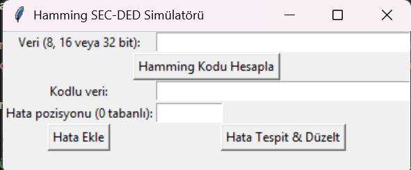
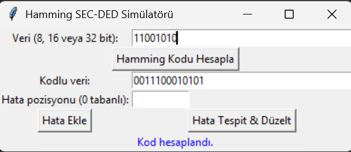
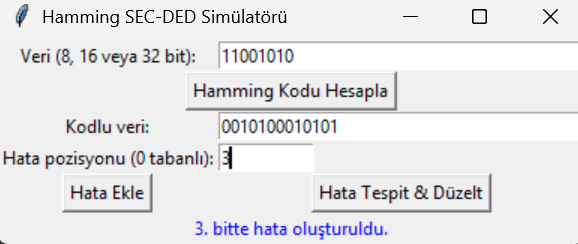
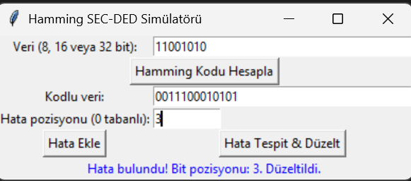

# 🧮 Hamming SEC-DED (Single Error Correction – Double Error Detection) Simülatörü

Bu proje,bir **Hamming SEC-DED kodlama ve düzeltme simülatörüdür**. Kullanıcı arayüzü (GUI) ile 8, 16 veya 32 bitlik ikili veriler üzerinde kodlama yapılabilir, hata oluşturulabilir ve bu hatalar tespit edilip düzeltilebilir.
Proje, Python dili ve Tkinter kütüphanesi kullanılarak gerçekleştirilmiştir.
---

## 📌 Projenin Özellikleri

-  Kullanıcıdan 8, 16 veya 32 bitlik veri girişi alır.
-  Hamming parite bitlerini hesaplayarak veriyle birlikte kodlar.
-  İstenilen pozisyonda yapay bir hata oluşturur.
-  Sendrom hesaplayarak hatayı bulur ve düzeltir.
-  Kullanıcı dostu bir grafik arayüz sunar (Tkinter ile).


---

## 🖼️ Ekran Görüntüleri

### 1. Ana Arayüz


### 2. Hamming Kodu Hesaplandıktan Sonra


### 3. Hatalı Bit Eklendiğinde


### 4. Hata Tespit ve Düzeltme


### 5. Hatalı Tipte (0 ve 1 dışında) Giriş Yapma 


### 6.Hatalı Sayıda (8, 16, 32 dışında) Giriş Yapma


---

## 🧠Fonksiyonlar ve İşlevleri Nasıl Çalışır? 
 

### 2.1. `validate_binary_input(data)`

**Görevi:** 
- Kullanıcının girdiği verinin sadece `0` ve `1`'lerden oluştuğunu,
- Uzunluğunun 8, 16 veya 32 bit olduğunu kontrol eder.

**Geri Dönüş:** 
- `(True, mesaj)` veya `(False, hata mesajı)`

---

### 2.2. `calculate_hamming(data_bits)`

**Amaç:** 
 Kullanıcının girdiği veri bitlerine karşılık gelen Hamming SEC-DED kodunu hesaplar.

**Adımlar:**
- Öncelikle gerekli parite bitleri sayısını hesaplar.
- Parite bitlerini ve veri bitlerini doğru pozisyonlara yerleştirir.
- Her parite bitini ilgili bitler üzerinden hesaplar.
- Son olarak, genel parite bitini (overall parity) ekler.

**Çıktı:** Hamming kodu (string) — parite bitleri ve genel parite dahil edilmiş kod.

---

### 2.3. `introduce_error(hamming_code, error_position)`

**Görevi:** 
Girilen Hamming kodunda belirtilen pozisyondaki biti tersine çevirir (0→1, 1→0).yapay hata oluşturur.

- **Girdi:**
  - `hamming_code` (string) — hata eklenmek istenen kod.
  - `error_position` (int) — hatanın oluşturulacağı bit pozisyonu (0 tabanlı).
- **Çıktı:** Hata oluşturulmuş Hamming kodu (string).

---

### 2.4. `detect_and_correct(hamming_code)`

- **Amaç:** Kodda hata olup olmadığını tespit eder ve tek bitlik hataları düzeltir.
- **Girdi:** `hamming_code` (string) — incelenen Hamming kodu.
- **Çıktı:** `(int, string)`
  - İlk değer: Hata pozisyonu (0 tabanlı), `0` ise hata yok, `-1` ise çift bitli hata (düzeltilemez).
  - İkinci değer: Düzeltme işlemi sonrası (veya orijinal) kod.
- **Detay:**
  - Parite bitleri tekrar kontrol edilir ve sendrom değeri hesaplanır.
  - Genel parite (overall parity) kontrol edilir.
  - Tek bitlik hata varsa düzeltilir.
  - Çift bitli hatalar tespit edilir ama düzeltilemez.
---

## 3. Grafik Arayüz (GUI) – `HammingGUI` Sınıfı

Tkinter ile tasarlanmıştır. Kullanıcının işlem yapmasını kolaylaştıran bir arayüz sunar.

### Öğeler:
- **Veri Girişi:** 8, 16 veya 32 bit.
- **Kod Hesaplama Butonu**
- **Kodlu Veri Gösterimi**
- **Hata Pozisyonu Girişi**
- **Hata Ekle Butonu**
- **Hata Tespit & Düzelt Butonu**
- **Sonuç Etiketi**

### Metotlar:
- `compute()`: Hamming kodunu hesaplar.
- `introduce_error()`: Belirtilen pozisyonda hata oluşturur.
- `detect()`: Hatayı tespit eder ve düzeltir.

---

## 4. Uygulama Başlatma

```python
if __name__ == "__main__":
    root = tk.Tk()
    app = HammingGUI(root)
    root.mainloop()
```


## 📽️ Demo Videosu

👉 [YouTube Linki](https://youtu.be/KCjG5y8z8UM)


